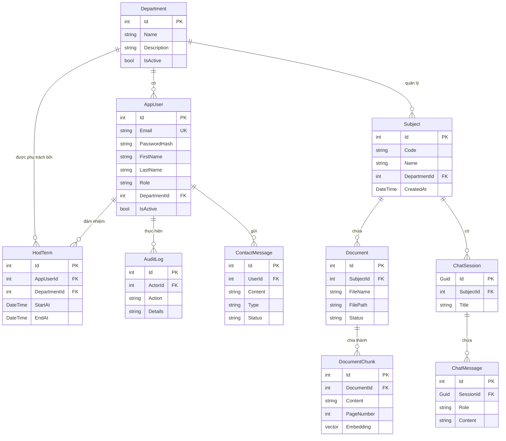

# Mô tả Entities trong dự án RagChatbot

## Tổng quan

Dự án sử dụng **Entity Framework Core** với **PostgreSQL** (có hỗ trợ extension `pgvector` cho vector search). Tất cả entity models nằm trong project `RagChatbot.DataAccess`, namespace `RagChatbot.DataAccess.EntityModels`.

Hệ thống hiện tại gồm **10 entity** chính:

| # | Entity | Mô tả | File |
|---|--------|--------|------|
| 1 | `AppUser` | Người dùng hệ thống | `EntityModels/AppUser.cs` |
| 2 | `Department` | Phòng ban / Khoa | `EntityModels/Department.cs` |
| 3 | `HodTerm` | Nhiệm kỳ Trưởng khoa (Head of Department) | `EntityModels/HodTerm.cs` |
| 4 | `Subject` | Môn học / Chủ đề | `EntityModels/Subject.cs` |
| 5 | `Document` | Tài liệu được upload | `EntityModels/Document.cs` |
| 6 | `DocumentChunk` | Đoạn văn bản đã được chia nhỏ + embedding | `EntityModels/DocumentChunk.cs` |
| 7 | `ChatSession` | Phiên hội thoại | `EntityModels/ChatSession.cs` |
| 8 | `ChatMessage` | Tin nhắn trong phiên hội thoại | `EntityModels/ChatMessage.cs` |
| 9 | `AuditLog` | Nhật ký hệ thống | `EntityModels/AuditLog.cs` |
| 10 | `ContactMessage` | Yêu cầu hỗ trợ, liên hệ | `EntityModels/ContactMessage.cs` |

---

## Sơ đồ quan hệ (ER Diagram)

---

## Chi tiết từng Entity

### 1. AppUser

> Đại diện cho người dùng trong hệ thống (Giảng viên, Sinh viên, Admin).

**File:** [`AppUser.cs`](file:///d:/Education/ChatBotRag_New/ChatBotRag/ChatBotRagRazorPage/RagChatbot.DataAccess/EntityModels/AppUser.cs)

| Property | Kiểu dữ liệu | Mô tả |
|----------|---------------|--------|
| `Id` | `int` | Khóa chính |
| `Email` | `string` | Email dùng để đăng nhập |
| `PasswordHash` | `string` | Mật khẩu đã mã hóa |
| `FirstName` | `string` | Tên người dùng |
| `LastName` | `string` | Họ người dùng |
| `Role` | `string` | Vai trò (Student, Teacher, Admin...) |
| `DepartmentId` | `int?` | Phòng ban (FK tới `Department`) |
| `Subscription` | `SubscriptionType` | Loại đăng ký (Free, Premium) |
| `IsActive` | `bool` | Trạng thái hoạt động |
| `DailyQueryCount` | `int` | Số lượt truy vấn trong ngày |
| `TodayChatCount` | `int` | Số tin nhắn gửi trong ngày |

**Navigation Properties:**
- `Department`: Thuộc về một Department.

---

### 2. Department

> Đại diện cho Phòng ban / Khoa trong trường.

**File:** [`Department.cs`](file:///d:/Education/ChatBotRag_New/ChatBotRag/ChatBotRagRazorPage/RagChatbot.DataAccess/EntityModels/Department.cs)

| Property | Kiểu dữ liệu | Mô tả |
|----------|---------------|--------|
| `Id` | `int` | Khóa chính |
| `Name` | `string` | Tên phòng ban |
| `Description` | `string` | Mô tả chi tiết |
| `IsActive` | `bool` | Trạng thái hoạt động |

**Navigation Properties:**
- `Users`: Chứa nhiều AppUser.
- `Subjects`: Chứa nhiều Subject.

---

### 3. HodTerm

> Nhiệm kỳ Trưởng khoa (Head of Department) cho biết ai là Trưởng khoa của Khoa nào trong thời gian nào.

**File:** [`HodTerm.cs`](file:///d:/Education/ChatBotRag_New/ChatBotRag/ChatBotRagRazorPage/RagChatbot.DataAccess/EntityModels/HodTerm.cs)

| Property | Kiểu dữ liệu | Mô tả |
|----------|---------------|--------|
| `Id` | `int` | Khóa chính |
| `AppUserId` | `int` | ID của Trưởng khoa (FK tới `AppUser`) |
| `DepartmentId` | `int` | ID của Phòng ban (FK tới `Department`) |
| `StartAt` | `DateTime` | Ngày bắt đầu nhiệm kỳ |
| `EndAt` | `DateTime?` | Ngày kết thúc nhiệm kỳ |

---

### 4. Subject

> Đại diện cho một môn học / chủ đề được quản lý bởi một Department.

**File:** [`Subject.cs`](file:///d:/Education/ChatBotRag_New/ChatBotRag/ChatBotRagRazorPage/RagChatbot.DataAccess/EntityModels/Subject.cs)

| Property | Kiểu dữ liệu | Mô tả |
|----------|---------------|--------|
| `Id` | `int` | Khóa chính |
| `Code` | `string` | Mã môn học |
| `Name` | `string` | Tên môn học |
| `DepartmentId` | `int?` | ID của Department (FK) |
| `IsActive` | `bool` | Trạng thái hoạt động |

**Navigation Properties:**
- `Department`: Thuộc về một Department.
- `Documents`: Chứa nhiều Document.
- `ChatSessions`: Chứa nhiều ChatSession.

---

### 5. Document

> Đại diện cho một tài liệu được upload lên hệ thống, thuộc về một Subject.

**File:** [`Document.cs`](file:///d:/Education/ChatBotRag_New/ChatBotRag/ChatBotRagRazorPage/RagChatbot.DataAccess/EntityModels/Document.cs)

| Property | Kiểu dữ liệu | Mô tả |
|----------|---------------|--------|
| `Id` | `int` | Khóa chính |
| `SubjectId` | `int` | FK tới `Subject` |
| `FileName` | `string` | Tên file gốc |
| `FilePath` | `string` | Đường dẫn lưu trữ file |
| `Status` | `string` | Trạng thái (Pending, Processing, Indexed, Failed) |

**Navigation Properties:**
- `Subject`: Thuộc về một Subject.
- `DocumentChunks`: Chia thành nhiều chunk.

---

### 6. DocumentChunk

> Đoạn văn bản được chia nhỏ từ Document, chứa vector embedding cho RAG.

**File:** [`DocumentChunk.cs`](file:///d:/Education/ChatBotRag_New/ChatBotRag/ChatBotRagRazorPage/RagChatbot.DataAccess/EntityModels/DocumentChunk.cs)

| Property | Kiểu dữ liệu | Mô tả |
|----------|---------------|--------|
| `Id` | `int` | Khóa chính |
| `DocumentId` | `int` | FK tới `Document` |
| `Content` | `string` | Nội dung văn bản |
| `PageNumber` | `int?` | Số trang (nếu có) |
| `Embedding` | `Vector?` | Embedding vector (pgvector) |

---

### 7. ChatSession

> Phiên hội thoại giữa user và chatbot trong một Subject cụ thể.

**File:** [`ChatSession.cs`](file:///d:/Education/ChatBotRag_New/ChatBotRag/ChatBotRagRazorPage/RagChatbot.DataAccess/EntityModels/ChatSession.cs)

| Property | Kiểu dữ liệu | Mô tả |
|----------|---------------|--------|
| `Id` | `Guid` | Khóa chính UUID |
| `SubjectId` | `int` | FK tới `Subject` |
| `Title` | `string` | Tiêu đề phiên chat |

**Navigation Properties:**
- `Subject`: Thuộc về một Subject.
- `Messages`: Chứa nhiều ChatMessage.

---

### 8. ChatMessage

> Tin nhắn chi tiết trong một phiên hội thoại (người dùng và bot).

**File:** [`ChatMessage.cs`](file:///d:/Education/ChatBotRag_New/ChatBotRag/ChatBotRagRazorPage/RagChatbot.DataAccess/EntityModels/ChatMessage.cs)

| Property | Kiểu dữ liệu | Mô tả |
|----------|---------------|--------|
| `Id` | `int` | Khóa chính |
| `SessionId` | `Guid` | FK tới `ChatSession` |
| `Role` | `string` | Vai trò (user, assistant) |
| `Content` | `string` | Nội dung tin nhắn |
| `Citations` | `string?` | Nguồn trích dẫn (JSON) |

---

### 9. AuditLog

> Ghi log lại các hành động quan trọng trên hệ thống.

**File:** [`AuditLog.cs`](file:///d:/Education/ChatBotRag_New/ChatBotRag/ChatBotRagRazorPage/RagChatbot.DataAccess/EntityModels/AuditLog.cs)

| Property | Kiểu dữ liệu | Mô tả |
|----------|---------------|--------|
| `Id` | `int` | Khóa chính |
| `ActorId` | `int` | Người thực hiện hành động (FK tới `AppUser`) |
| `Action` | `string` | Hành động thực hiện |
| `TargetObjectId` | `string` | Đối tượng bị tác động |
| `Details` | `string` | Chi tiết hành động |

---

### 10. ContactMessage

> Ghi nhận các yêu cầu hỗ trợ (Support) hoặc báo lỗi từ học sinh.

**File:** [`ContactMessage.cs`](file:///d:/Education/ChatBotRag_New/ChatBotRag/ChatBotRagRazorPage/RagChatbot.DataAccess/EntityModels/ContactMessage.cs)

| Property | Kiểu dữ liệu | Mô tả |
|----------|---------------|--------|
| `Id` | `int` | Khóa chính |
| `UserId` | `int` | FK tới `AppUser` |
| `Content` | `string` | Nội dung báo cáo/kêu cứu |
| `Type` | `ContactType` | Loại (DocumentIssue, ChatIssue, GeneralFeedback) |
| `Status` | `ContactStatus` | Trạng thái (Pending, Processing, Resolved) |
| `RelatedId` | `int?` | ID liên quan (nếu có lỗi cụ thể) |

---

## Tổng hợp quan hệ giữa các Entity

| Quan hệ | Loại | Khóa ngoại (FK) |
|---------|------|-----|
| `Department` → `AppUser` | One-to-Many | `AppUser.DepartmentId` |
| `Department` → `Subject` | One-to-Many | `Subject.DepartmentId` |
| `AppUser` / `Department` → `HodTerm` | One-to-Many | `HodTerm.AppUserId`, `HodTerm.DepartmentId` |
| `Subject` → `Document` | One-to-Many | `Document.SubjectId` |
| `Subject` → `ChatSession` | One-to-Many | `ChatSession.SubjectId` |
| `Document` → `DocumentChunk` | One-to-Many | `DocumentChunk.DocumentId` |
| `ChatSession` → `ChatMessage` | One-to-Many | `ChatMessage.SessionId` |
| `AppUser` → `AuditLog` | One-to-Many | `AuditLog.ActorId` |
| `AppUser` → `ContactMessage` | One-to-Many | `ContactMessage.UserId` |
