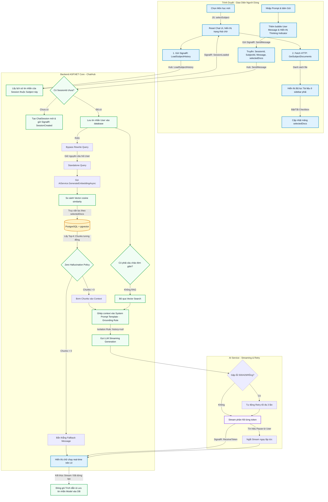

# Luồng Hoạt Động Hệ Thống RAG Chatbot

Tài liệu mô tả chi tiết từ đầu đến cuối (End-to-End) hai luồng nghiệp vụ chính của hệ thống: **Xử lý tài liệu (Document Ingestion)** và **Truy vấn - Trả lời (RAG Chat Flow)**. Hệ thống được trang bị cơ chế **hai lớp bảo vệ số liệu** (Page Boundary Protection + Token Masking) đảm bảo không có con số tài chính nào bị cắt ngang.

---

## 1. Sơ đồ Tổng Quan (Flowchart)



---

## 2. Luồng Xử Lý Tài Liệu (Document Ingestion Flow)

Khi giảng viên / sinh viên tải lên một tài liệu (PDF, DOCX) vào hệ thống, các bước sau sẽ diễn ra:

### Bước 1: Tiếp nhận file từ người dùng
*   **Thành phần:** `DocumentController` (Tầng Presentation)
*   **Hoạt động:** Người dùng chọn file và ấn Upload. `DocumentController` nhận file qua HTTP POST.
*   **Lưu trữ:** File được `IGoogleDriveService` đẩy lên Google Drive. Nếu lỗi, nó fallback lưu ở Local Storage của server.
*   **Ghi nhận Database:** Thông tin file (Tên, Đường dẫn, SubjectId) được tạo dưới dạng bản ghi `Document` lưu vào PostgreSQL với trạng thái `Status = "Pending"`.

### Bước 2: Kích hoạt Background Job
*   **Thành phần:** `DocumentProcessingJob` (Tầng Business - Background Service)
*   **Hoạt động:** 
    *   Job này chạy định kỳ (vd: mỗi 10 giây). Nó sẽ quét database tìm các tài liệu đang ở trạng thái `Pending`.
    *   Khi tìm thấy, nó cập nhật trạng thái thành `Processing`.

### Bước 3: Trích xuất nội dung (Parsing)
*   **Thành phần:** `PdfPig` (thư viện cho PDF) hoặc `OpenXml` (thư viện cho DOCX)
*   **Hoạt động:** Background Job tải file về server (nếu nằm trên Drive) và bắt đầu đọc. Nó trích xuất toàn bộ text, đồng thời theo dõi văn bản đó thuộc **Trang số mấy (Page Number)**.

### Bước 4: Chia nhỏ văn bản (Text Chunking — Hai lớp bảo vệ số liệu)
*   **Thành phần:** `DocumentProcessingJob` (Tiền xử lý ranh giới trang) + `TextChunkingService` (Masking & Splitting)
*   **Hoạt động:** Văn bản dài hàng trăm trang được chia thành các đoạn nhỏ (Chunks) mang ngữ nghĩa đầy đủ, qua hai lớp bảo vệ:
    *   **Lớp 1 — Page Boundary Protection:** Trước khi chunking, `DocumentProcessingJob` ghép nối text giữa các trang. Thuật toán quét ngược tìm ranh giới câu cuối cùng (`.`, `?`, `!`, `\n`) nhưng **tự động bỏ qua** mọi dấu chấm nằm giữa hai chữ số (ví dụ: dấu `.` trong `43.000` hay `10.000.000`). Điều này ngăn chặn việc cắt ngang số liệu tài chính ngay từ bước ghép trang.
    *   **Lớp 2 — Token Masking (`TextChunkingService`):**
        1.  Loại bỏ các artifact lặp lại trong layout (ví dụ: header trang "NGUYÊN LÝ KẾ TOÁN").
        2.  Thực hiện vòng lặp `while` với regex `(\d+)\s*\.\s*(\d+)` để **đồng thời** collapse mọi whitespace/newline ẩn do extractor tạo ra xung quanh dấu chấm VÀ thay thế bằng mask `ALPHANUMERICDOTMASK`. Vòng lặp đảm bảo mọi dấu chấm trong số nhiều dấu chấm (ví dụ: `10.000.000` → `10ALPHANUMERICDOTMASK000ALPHANUMERICDOTMASK000`) đều được mask.
        3.  Đưa text đã mask vào `TextChunker.SplitPlainTextLines` (threshold 350 token/dòng) và `SplitPlainTextParagraphs` (400 token/chunk, 50 token overlap).
        4.  Khôi phục mask `ALPHANUMERICDOTMASK` → `.` và dọn dẹp các header Markdown lẻ (**bold**) bị dính ở cuối chunk.
    *   Kích thước mỗi chunk: Tối đa khoảng 400 tokens.
    *   Overlap (chồng lấn): 50 tokens giữa chunk trước và chunk sau để giữ trọn vẹn ngữ cảnh.

### Bước 5: Chuyển đổi thành Vector (Embedding)
*   **Thành phần:** `IAiService` -> Google AI Studio (`text-embedding-004`)
*   **Hoạt động:** 
    *   Mỗi chunk văn bản được gửi lên API của Google AI.
    *   Google trả về một **Vector 768 chiều** (một mảng gồm 768 con số thập phân biểu diễn ý nghĩa/ngữ nghĩa của đoạn văn bản đó).

### Bước 6: Lưu trữ Vector
*   **Thành phần:** `IVectorSearchService` -> EF Core -> PostgreSQL (`pgvector`)
*   **Hoạt động:** Đoạn văn bản (text), số trang (page index), và Vector (768 chiều) được lưu thành bản ghi `DocumentChunk` vào database. 
    *   Trạng thái tài liệu cập nhật thành `Indexed`.

---

## 3. Luồng Truy Vấn & Chat (RAG Chat Flow)

### 3.1. Kịch Bản A: Người dùng chọn Môn học

Khi người dùng nhấn chọn một môn học bất kỳ từ danh sách Sidebar trái:

1. **Giao diện Client (`Index.cshtml`):**
   * Hàm JavaScript `selectSubject(id, name, el)` được kích hoạt.
   * **Giao diện Chat** được làm mới: Clear màn hình chat cũ, thay đổi tiêu đề chat theo môn học hiện tại, đổi placeholder ở ô nhập prompt và kích hoạt các nút/ô nhập liệu.
   * **Nạp lịch sử trò chuyện (Chat History):** Gửi yêu cầu qua kết nối SignalR:
     ```javascript
     connection.invoke("LoadSubjectHistory", id);
     ```
     Server nhận yêu cầu, tìm bản ghi `ChatSession` gần nhất của người dùng cho môn học này, lấy danh sách `ChatMessage` cũ và đẩy ngược lại về giao diện qua sự kiện `SessionLoaded`.
   * **Nạp bộ lọc tài liệu (`loadDocFilter`):** Gửi yêu cầu HTTP GET đến endpoint:
     ```
     GET /Document/GetSubjectDocuments?subjectId={subjectId}
     ```
     API trả về danh sách toàn bộ các file tài liệu đã được chỉ mục hóa (indexed) thành công trong môn học đó.
     * **Sidebar phải (`#docFilterPanel`)** xuất hiện và vẽ danh sách checkbox tương ứng với các file.
     * Mặc định ban đầu, **tất cả** checkbox tài liệu đều được tích chọn (`checked`).

2. **Khi thay đổi tài liệu (Tích / Bỏ tích các checkbox tài liệu ở Sidebar phải):**
   * Mỗi hành động tích chọn/bỏ tích sẽ kích hoạt hàm `updateFilterInfo()`.
   * Mảng danh sách file được chọn sẽ được thu thập thông qua hàm `getSelectedDocIds()` bằng cách quét các checkbox đang được chọn:
     ```javascript
     const selectedDocs = [...document.querySelectorAll('.doc-checkbox:checked')].map(c => parseInt(c.value));
     ```
   * Dữ liệu này chỉ được lưu trữ tạm thời trên Client và sẽ được gửi lên Server mỗi khi người dùng gửi prompt mới.

---

### 3.2. Kịch Bản B: Người dùng nhập Prompt & Gửi câu hỏi

Khi người dùng nhập văn bản vào ô chat và nhấn gửi (hoặc nhấn Enter):

#### Bước 1: Gửi tin nhắn qua SignalR
*   **Thành phần:** UI (Trình duyệt) -> `ChatHub` (Tầng Presentation)
*   **Hoạt động:** 
    *   Lấy prompt của người dùng và thêm ngay lập tức vào màn hình chat dưới dạng bubble tin nhắn của `user`.
    *   Hiển thị trạng thái "AI đang xử lý" (Thinking Indicator) cùng hiệu ứng ba chấm chuyển động.
    *   Thu thập danh sách `selectedDocs` (mảng ID các tài liệu đang được tích chọn).
    *   Gửi gói tin thông qua kết nối SignalR đến `ChatHub`:
      ```javascript
      connection.send("SendMessage", currentSessionId, currentSubjectId, msg, selectedDocs);
      ```

#### Bước 2: Xử lý và Lưu tin nhắn người dùng
*   **Thành phần:** `ChatHub` -> `IChatService`
*   **Hoạt động:** 
    *   Nếu chưa có Session ID (phiên chat mới), hệ thống tự động tạo một `ChatSession` mới trong DB và gửi ID về client qua sự kiện `SessionCreated`.
    *   Tin nhắn của User được lưu vào DB (`ChatMessage`) với Role là `User`.

#### Bước 3: Tiền xử lý & Cấu trúc Truy vấn (Bypass Rewrite Query)
*   **Thành phần:** `IAiService` (Query Rewriting)
*   **Hoạt động:**
    1.  **Lấy bối cảnh:** Trích xuất 3 tin nhắn gần nhất từ lịch sử trò chuyện để sử dụng nếu cần thiết.
    2.  **Viết lại câu hỏi (Đã vô hiệu hóa):** Để tiết kiệm token LLM, hệ thống hiện tại **bỏ qua bước viết lại câu hỏi**. Câu hỏi gốc của người dùng được sử dụng trực tiếp làm Standalone Query.
    3.  **Lọc câu chào hỏi:** Nếu câu hỏi chỉ là câu chào ngắn gọn (vd: "chào bạn"), hệ thống tự động trả lời bằng code mà không cần RAG hay LLM.

#### Bước 4: Đánh giá & Lọc dữ liệu (Vector Search)
*   **Thành phần:** `IAiService` (Embedding) và `IVectorSearchService` (Tìm kiếm)
*   **Hoạt động:**
    1.  **Embed Câu hỏi:** Standalone Query được biến thành một Vector 768 chiều.
    2.  **Pre-filtering & Similarity:** Vector câu hỏi được đưa xuống PostgreSQL. Extension `pgvector` sử dụng HNSW index so sánh với các DocumentChunks, đồng thời áp dụng màng lọc cứng `WHERE DocumentId IN (selectedDocs)`.
    3.  **Lấy Top K:** PostgreSQL trả về Top các đoạn văn bản (chunks) tương đồng nhất.

#### Bước 5: Kiểm soát rủi ro & Tạo Prompt (Zero Hallucination & Grounding)
*   **Thành phần:** `IChatService`
*   **Hoạt động:** 
    *   **ZERO_HALLUCINATION_POLICY:** Nếu không có chunk nào tương đồng, hệ thống không gọi LLM sinh văn bản mà trả về ngay câu Fallback: *"Hệ thống không tìm thấy thông tin trong các tài liệu đã chọn"*.
    *   **GROUNDING_RULE:** Bơm các chunks tìm được vào ngữ cảnh. Ép LLM chỉ được phép trả lời dựa trên những chunks này.

#### Bước 6: Sinh câu trả lời (LLM Streaming, Retry & Isolation Rule)
*   **Thành phần:** `IAiService` -> Google AI Studio
*   **Hoạt động:**
    *   **ISOLATION_RULE:** Tách biệt hoàn toàn lịch sử chat (`history = null`) khỏi bước sinh văn bản cuối cùng để tránh hiện tượng Data Leakage (AI học lỏm kiến thức từ chat history).
    *   **Cơ chế Retry (Kháng lỗi):** LLM xử lý Standalone Query dựa trên ngữ cảnh được cấp. Nếu API của Google trả về lỗi 500, 429 hoặc trả về văn bản rỗng, hệ thống sẽ **tự động gọi lại (Retry) tối đa 3 lần** trước khi bỏ cuộc.
    *   LLM stream trả về từng token.

#### Bước 7: Đẩy dữ liệu về Giao diện & Dừng tạo (Real-time Streaming & Pause)
*   **Thành phần:** `ChatHub` -> UI
*   **Hoạt động:** 
    *   Mỗi khi LLM sinh ra một token, `ChatHub` gửi ngay lập tức tín hiệu `ReceiveToken` về giao diện.
    *   Giao diện hiển thị chữ chạy giống hệt ChatGPT mà không cần đợi load xong toàn bộ.
    *   **Dừng tạo (Pause):** Tại bất kỳ thời điểm nào, người dùng có thể bấm nút "Dừng tạo". SignalR sẽ gửi lệnh hủy thông qua `CancellationToken`, ngắt ngay lập tức tiến trình stream từ API của Google, lưu trữ câu trả lời dang dở và báo *"(Đã dừng tạo)"*.

#### Bước 8: Xử lý Trích dẫn & Lưu trữ (Citation Injection)
*   **Thành phần:** `IChatService` -> `ChatHub`
*   **Hoạt động:**
    *   Bắt buộc đính kèm Metadata (Tên file, Index trang) vào các node thông tin trả về.
    *   Lưu toàn bộ tin trả lời của AI cùng JSON trích dẫn vào database với Role là `Model`.
    *   Gửi tín hiệu kết thúc về giao diện kèm theo danh sách trích dẫn để hiển thị.

---

## 4. Cơ Chế Giao Tiếp Realtime (SignalR Communication)

Dự án RagChatbot sử dụng **SignalR** để cung cấp các tính năng thời gian thực (real-time) cho người dùng, chủ yếu hỗ trợ trải nghiệm chat trực tuyến mượt mà và thông báo trạng thái của hệ thống.

### 4.1. Các Hubs hiện có
Hệ thống hiện tại định nghĩa 2 Hub chính trong thư mục `Hubs` của lớp `PresentationRazorPage`:

#### A. `ChatHub` (`/chatHub`)
Đây là Hub cốt lõi phục vụ tính năng RAG Chatbot, xử lý toàn bộ luồng giao tiếp giữa người dùng và AI Assistant.
- **`LoadSubjectHistory(int subjectId)`**: Tải lại lịch sử trò chuyện của người dùng đối với một môn học (Subject) cụ thể.
- **`SendMessage(string sessionIdStr, int subjectId, string message, List<int>? documentIds)`**: Gửi tin nhắn mới tới AI.
- **`StopGeneration(string sessionIdStr)`**: Hủy quá trình AI đang sinh câu trả lời bằng cách dùng `CancellationTokenSource`.

**Các Event Client lắng nghe (từ ChatHub):**
- `SessionLoaded`: Khi lịch sử chat đã tải xong.
- `SessionCreated`: Khi một phiên chat mới bắt đầu.
- `ReceiveToken`: Nhận token văn bản dạng stream từ AI.
- `ReceiveError`: Nhận thông báo lỗi.

#### B. `AppNotificationHub` (`/appNotificationHub`)
Đây là Hub chung của hệ thống để quản lý và gửi các thông báo toàn cầu tới client, giúp đồng bộ hóa giao diện người dùng theo thời gian thực mà không cần tải lại trang.
- Server gọi qua `IHubContext<AppNotificationHub>` từ các Background Job hoặc Controller/PageModel để đẩy (push) thông báo.

**Các Event Client lắng nghe (từ AppNotificationHub):**
- `DocumentListChanged`: Báo cho giao diện quản lý tài liệu tải lại danh sách tài liệu mới nhất (gọi từ `DocumentProcessingJob` hoặc PageModel khi tải lên/xóa/đổi trạng thái).
- `SubjectListChanged`: Báo cho giao diện quản lý môn học tải lại danh sách môn học mới nhất (gọi từ Admin khi thêm/sửa/vô hiệu hóa môn học).

### 4.2. Cấu hình (Configuration)
SignalR được đăng ký và map endpoint tại `Program.cs`:
```csharp
builder.Services.AddSignalR();
app.MapHub<RagChatbot.PresentationRazorPage.Hubs.ChatHub>("/chatHub");
app.MapHub<RagChatbot.PresentationRazorPage.Hubs.AppNotificationHub>("/appNotificationHub");
```

---

## 5. Tóm Lược Các Công Nghệ Trọng Điểm

1.  **Dữ liệu luân chuyển (DTOs / ViewModels):** Tất cả dữ liệu đi từ Database lên giao diện đều được bọc trong các Data Transfer Objects (DTO) tại Business Layer, và bọc trong ViewModels tại Presentation Layer.
2.  **Entity Framework Core & pgvector:** Nòng cốt của hệ thống RAG nằm ở khả năng lưu trữ mảng vector và tính toán khoảng cách (distance) thông qua EF Core và PostgreSQL.
3.  **SignalR:** Đảm nhận kết nối 2 chiều (Duplex) giúp trải nghiệm chat cực kỳ mượt mà.
4.  **Kiến trúc N-Tier:** Việc chia tách giúp code cực kỳ gọn gàng. Tầng Business chỉ gọi tầng Data Access qua các Repository chứ không tiêm trực tiếp DbContext, bảo toàn tính độc lập và dễ dàng kiểm thử.
