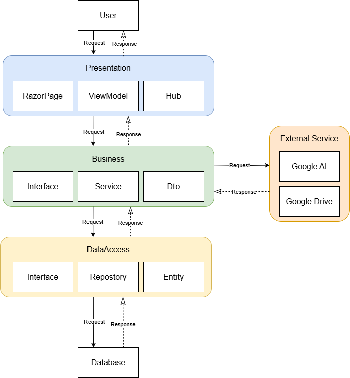

# RAG Chatbot — Hệ thống Chatbot Hỗ trợ Học tập

Ứng dụng Web áp dụng kỹ thuật **RAG (Retrieval-Augmented Generation)** cho phép sinh viên hỏi đáp tự nhiên và xem tài liệu dựa trên tài liệu môn học (PDF, DOCX). Bot chỉ trả lời trong phạm vi tài liệu được cung cấp và luôn kèm theo trích dẫn nguồn (tên file, số trang).

## Tính Năng Nổi Bật

- **Quản lý Môn học & Tài liệu:** Tạo môn học và upload PDF/DOCX vào từng môn.
- **Xử lý Ngầm (Background Job):** Tài liệu tải lên được tự động trích xuất, chia nhỏ (Local Semantic Chunking) và mã hoá thành vector trong nền. Hệ thống chunking sử dụng thuật toán masking `ALPHANUMERICDOTMASK` để bảo toàn 100% tính toàn vẹn các con số tài chính/kế toán (ví dụ: `43.000`, `10.000.000`).
- **Vector Search:** Mỗi chunk được embedding thành vector 768 chiều lưu trong PostgreSQL (`pgvector`), tìm kiếm bằng Cosine Similarity với HNSW Index.
- **Realtime Streaming Chat:** Dùng **SignalR** để stream từng token phản hồi của AI về giao diện (giống ChatGPT).
- **Trích Dẫn Thông Minh (Citations):** Cuối mỗi câu trả lời, Bot chỉ rõ tên file và số trang đã dùng làm ngữ cảnh.
- **Lịch sử Chat:** Hệ thống lưu và tải lại lịch sử hội thoại theo từng môn học.
- \*\*Xem tài lieu: Hệ thống cho phép học sinh xem tài lieu mà giảng viên đã up lên nếu muốn theo dõi chi tiết

## Kiến Trúc Kỹ Thuật

| Thành phần        | Công nghệ                                                            |
| ----------------- | -------------------------------------------------------------------- |
| Backend Framework | ASP.NET Core Razor Pages (.NET 8)                                    |
| Cơ sở dữ liệu     | PostgreSQL + `pgvector` (Docker)                                     |
| ORM               | Entity Framework Core                                                |
| AI / LLM          | Google AI Studio (`gemini-1.5-flash`)                                |
| Embedding Model   | `text-embedding-004` (768 chiều)                                     |
| Real-time         | ASP.NET Core SignalR                                                 |
| File Parsing      | `UglyToad.PdfPig` (PDF), `DocumentFormat.OpenXml` (DOCX)             |
| Text Chunking     | `Microsoft.SemanticKernel.Text.TextChunker` + Custom Numeric Masking |
| Frontend          | Razor Pages + Bootstrap + ViewModels                                 |
| Data Transfer     | Data Transfer Objects (DTOs)                                         |

## Cấu Trúc Dự Án (N-Tier Architecture)

Dự án tuân thủ chặt chẽ mô hình **N-Tier**. Dữ liệu chỉ chảy theo một chiều từ trên xuống dưới thông qua **Dependency Injection (DI)**, giúp các tầng độc lập với nhau, dễ dàng nâng cấp và viết Unit Test.

```text
CHATBOTRAG
│
├── RagChatbot.PresentationRazorPage/ (Tầng giao diện, Razor Pages, SignalR)
│   ├── Pages/                 (Các trang Razor và PageModel xử lý request)
│   ├── Hubs/                  (SignalR hubs: ChatHub, AppNotificationHub)
│   ├── BackgroundJobs/        (Tác vụ nền: xử lý tài liệu, dọn chat log, email)
│   ├── ViewModels/            (Các ViewModel dùng cho form/trang)
│   ├── wwwroot/               (Chứa các file tĩnh: CSS, JS, thư viện ngoài...)
│   ├── Properties/            (Chứa launchSettings.json)
│   └── Program.cs             (Nơi cấu hình Middleware, Dependency Injection)
│
├── RagChatbot.Business/       (Tầng Xử Lý Nghiệp Vụ - Logic Layer)
│   ├── DTOs/                  (Data Transfer Objects: SubjectDto, DocumentDto...)
│   ├── Interfaces/            (Định nghĩa hợp đồng: IDocumentService, ITextChunkingService...)
│   ├── Mappings/              (Mapping extensions)
│   └── Services/              (Thực thi logic: ChatService, AiService, TextChunkingService,
│                                VectorSearchService, GoogleDriveService...)
│
└── RagChatbot.DataAccess/     (Tầng Truy Xuất Dữ Liệu - Data Access Layer)
    ├── Data/                  (ApplicationDbContext: Cấu hình Entity Framework Core)
    ├── EntityModels/          (Khai báo các thực thể/Bảng DB: Document, ChatSession...)
    ├── Interfaces/            (Định nghĩa hợp đồng cho Repository: IRepository...)
    ├── Repositories/          (Triển khai truy vấn DB: DocumentRepository, AppUserRepository...)
    └── Migrations/            (Lịch sử phiên bản lược đồ CSDL - Database Schema)
```

### Ảnh kiến trúc hệ thống



### Giải thích Luồng Hoạt Động

1. **Người dùng** thao tác trên trình duyệt (Upload file, gửi tin nhắn).
2. Yêu cầu được xử lý bởi **Razor Pages/PageModel** (các luồng web thông thường) hoặc **ChatHub** (luồng chat realtime).
3. Razor Pages/Hub không tự xử lý mà gọi xuống **Tầng Business** (ví dụ: `IDocumentService`, `IAiService`, `ITextChunkingService`) để thực thi logic nghiệp vụ.
4. **Xử lý Chunking thông minh:** `DocumentProcessingJob` điều phối quy trình xử lý tài liệu ngầm. Khi ghép nối text giữa các trang, nó dùng thuật toán quét ngược thông minh bỏ qua dấu chấm số (numeric period) để tránh cắt ngang các con số tài chính. Sau đó, `TextChunkingService` mask toàn bộ dấu chấm giữa chữ số bằng `ALPHANUMERICDOTMASK` trước khi chia nhỏ, đảm bảo tính toàn vẹn 100% cho các số như `43.000` hay `10.000.000`.
5. Nếu Tầng Business cần đọc/ghi dữ liệu, nó sẽ gọi xuống **Tầng Data Access** thông qua các `Repository`. Tầng Data Access sẽ dùng Entity Framework Core để biến đổi code thành lệnh SQL chạy trên PostgreSQL.
6. Nếu Tầng Business cần xử lý AI hoặc lưu trữ Cloud, nó sẽ gọi ra các API bên ngoài như Google AI Studio hoặc Google Drive.

### Kiến Trúc Giao Tiếp Mức Cao

```text
    [Người dùng cuối]
       │       ▲
 (Nhập liệu)   │ (Hiển thị / Phản hồi)
       ▼       │
┌─────────────────────────────────────────────────────────┐
│            PRESENTATION LAYER (Razor Pages & SignalR)   │
│                                                         │
│   [View / UI] <────(Dữ liệu)────> [PageModel / Hub]     │
└───────────────────────┬─────────────────▲───────────────┘
                        │                 │
             (Truyền tham số / DTO)  (Trả về DTO / ViewModel)
                        │                 │
                        ▼                 │
┌─────────────────────────────────────────────────────────┐
│                BUSINESS LAYER (Services)                │
│                                                         │
│                     [Services]                          │
│           (ChatService, DocumentService...)             │
└──────┬────────────────┬─────────────────▲───────────────┘
       │                │                 │
       │         (Gọi hàm xử lý)   (Trả về Entity)
       │                │                 │
       │                ▼                 │
       │ ┌──────────────────────────────────────────────┐
       │ │            DATA ACCESS LAYER (DAL)           │
       │ │                                              │
       │ │                [Repositories]                │
       │ │                      ↕                       │
       │ │                 [DbContext]                  │
       │ └──────────────────────┬───────────────▲───────┘
       │                        │               │
(Gọi API bên ngoài)      (Gửi câu lệnh SQL) (Dữ liệu thô)
       │                        │               │
       ▼                        ▼               │
┌────────────────┐       ┌──────────────────────┴─────────┐
│ [External APIs]│       │                                │
│ - Google AI    │       │       [(Cơ sở dữ liệu)]        │
│ - Google Drive │       │     PostgreSQL + pgvector      │
└────────────────┘       └────────────────────────────────┘
```

## Điểm Nổi Bật Kỹ Thuật (Technical Highlights)

### Hệ thống Chunking thông minh hai lớp bảo vệ

Dự án triển khai cơ chế **hai lớp bảo vệ** cho tính toàn vẹn dữ liệu số:

1. **Lớp 1 — Page Boundary Protection (`DocumentProcessingJob.cs`):** Khi ghép nối text giữa các trang, thuật toán quét ngược tìm ranh giới câu nhưng **tự động bỏ qua** các dấu chấm nằm giữa hai chữ số (ví dụ: dấu `.` trong `43.000`), chỉ cắt tại dấu chấm câu thật sự.
2. **Lớp 2 — Token Masking (`TextChunkingService.cs`):** Trước khi đưa vào Sentence Splitter, mọi dấu chấm giữa các chữ số (kể cả bị xen kẽ whitespace/newline do extractor tạo ra) đều được thay thế bằng mask `ALPHANUMERICDOTMASK`. Vòng lặp `while` đảm bảo xử lý triệt để số nhiều dấu chấm như `10.000.000`. Mask được khôi phục lại sau khi chunking hoàn tất.

## Hướng Dẫn Cài Đặt & Khởi Chạy

### Bước 1: Cấu hình biến môi trường

Tạo file `.env` ở thư mục gốc (xem `.env.example` để tham khảo):

```env
DB_CONNECTION_STRING=Host=localhost;Port=5433;Database=RagChatbotDb;Username=postgres;Password=Password123!
GOOGLE_API_KEY=your_google_ai_studio_api_key_here
```

> Lấy API Key miễn phí tại [Google AI Studio](https://aistudio.google.com/apikey).

### Bước 2: Khởi động Database (Docker)

```bash
docker compose up -d
```

Lệnh này khởi chạy PostgreSQL với `pgvector` và map ra cổng `5433`.

### Bước 3: Chạy Ứng Dụng Web

```bash
cd RagChatbot.PresentationRazorPage
dotnet run
```

Ứng dụng tự động chạy **EF Core Migration** để khởi tạo schema database ở lần đầu tiên.

### Bước 4: Truy cập

Mở trình duyệt tại `http://localhost:5057` hoặc `https://localhost:7030` (theo `launchSettings.json`).

## Hướng Dẫn Sử Dụng

1. Vào tab **Documents** → Tạo môn học mới (ví dụ: `PRN222` - `Lập trình .NET`).
2. Upload file PDF/DOCX cho môn học. Trạng thái ban đầu là `Pending`.
3. Chờ ~10 giây để background job xử lý → Refresh trang → Trạng thái chuyển sang `Indexed`.
4. Quay lại tab **Chat** → Chọn môn học ở thanh bên trái → Bắt đầu hỏi! hoặc tab xem tài lieu và bắt đàu xem tài lieu chi tiết

## Tài Liệu Chi Tiết

| Tài liệu                                     | Mô tả                                                        |
| -------------------------------------------- | ------------------------------------------------------------ |
| [Docs/SYSTEM_FLOW.md](./Docs/SYSTEM_FLOW.md) | Luồng hoạt động chi tiết: Document Ingestion & RAG Chat Flow |
| [Docs/ENTITIES.md](./Docs/ENTITIES.md)       | Mô tả Entities, DTOs, ViewModels & cấu hình DbContext        |
